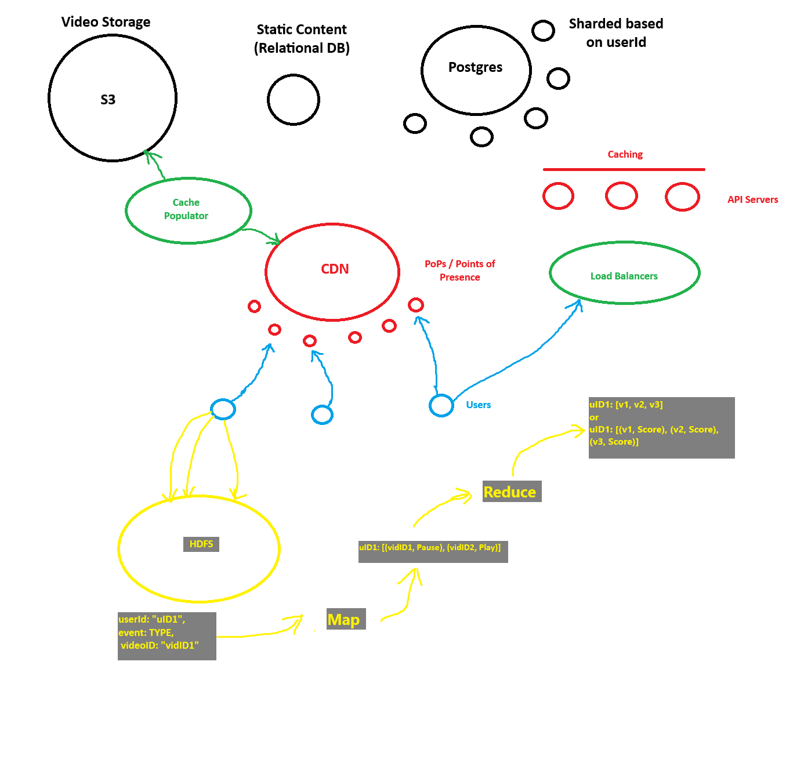

# Parts to design:
- Core user flow (video):
  - Fast Latencies
  - High Availability
  - Global reach
- Recommendation engine
- 200 M users

## Data to store:
- Video
  - 10k Videos, which are 1h avg
  - SD, 10 GB/h
  - HD, 20 GB/h
  - 10k * 30 = 300.000 Gb = 300 TB
- User metadata
- Static content (thumbnails, descriptions, tags, etc.)
  - 100B (each video metadata) * 1000 (amount of videos) = 100KB
  - 100KB * 200M (user amount) = 1GB * 20K = 20 TB of metadata (User + Static Content)
- Logs

## Streaming Data:
There are 3600 seconds in one hour. And there are 10M users on peak.

As most of the users would be streaming at HD, this would require (20 Gb/h) / 1000 = 4.5 MBps ~= 5 MBps.

Then 5 MBps * 10 M users = 50 TBps. Which would be the peak.

As it is lots of data, a CDN is advisable to make it available across multiple locations.

As the users requests data, the PoPs needs to have content cached. And the cache would be loaded with popular movies and new releases asynchronously.

The API Servers would serve the static content, which would be connected through a Load Balancer. The Load Balancer could distribute the load based on userId or based on Round-Robin.

If the Round Robin approach is made, then the userId needs to be used to go to the appropriate user shard based on the request on the Postgres DB.

As the system has a total of 20 TBs for static content, then it can be stored in cached memory.

## Recommendation Engine
The logs would be feeding the system that backs the recommendation engine, with a sort of "Map Reduce" job. Which would asynchronously consume the logs stored, and the recommendation engine would return a more meaningful data.

As the logs are being stored, they can be stored in "Hadoop HDFS" distributed file system.

A log would look like:
```
userId: "uID1" event: TYPE videoID: "vidID1"

enum TYPE {
  Pause,
  ClickOnScreen,
  MouseMove
}
```

On the enum, there would be anything that would help to predict engagement.

There could be also other things, like the region or language, to be stored on the logs. But those are the core values of the logs.

Probably the recommendation engine would return an score for the user on each video.

The engine would probably have some machine learning model, that gets fed in the intermediary data. Or some data pipeline, that grabs the data on the reduce function. But the output could be:
- uID1 pointing to a score of each video or
- uID1 pointing to an stack ranking of videos

The output of the data would depend on the data science department or the data that one thinks that is meaningful for the engine. The Map-Reduce function could be modified in different ways.

