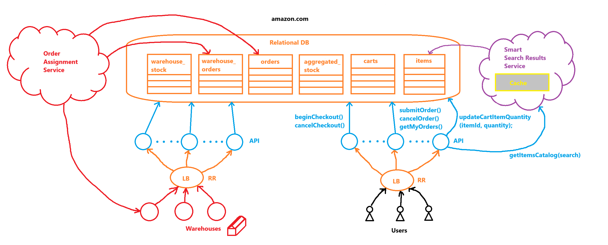

# Design Amazon
## System Requirements
The system would include the e-commerce business of Amazon. It is left out of scope "Amazon Web Services" or any other Amazon product.

Main parts of the design:
- Search (*Service*)
- Items ( Individual items or the search result. **Stock** amounts as well )
- Cart
- Checkout ( **Reserve** )
- Orders ( Submit and cancel ) ( *Service* )
- Warehouses ( **Stock** )
- amazon.com
- Focus core functionality
- 10 Orders per second

These are the elements of a system. However, the scope of the question doesn't includes:
- Homepage, we are just assume that is just a search box for people to type in
- Multiple carts are also out of scope. A single cart per user is enough.
- Neither the recommendation engine subsystem, that involves lots of machine learning
  - It would be assumed to have a search result recommendation engine service out of the box, that has been created for Amazon.
  - We only need to figure out where the subsystem is going to live on the greater system

The stock of items needs to be handled:
- Users cannot consume things out of stock
- The stock needs to decrease every time a purchase gets made

If there are two or more users watching at the same item, and there is low stock (1 or 2 remaining). As this is a complex problem to solve. Every user can see the item and how much is left. And any user can also add it to the cart, if the item is still on stock. Once beginning the checkout, the user would be alerted if the item is not in stock anymore.

If the item is still on stock, the system would reserve it for the user for 10 minutes or the duration of the checkout process (which can be capped at 10 minutes).

The system would include what happens when orders are assigned to an specific amazon warehouse. This involes the case when having an order in which items are located at different warehouses. In this case, the order needs to be split up and the customer ends up receiving two packages instead of only one. 

This means that the system needs to solve how stock comes into place when it comes to the warehouses and delivery aspects. However, all of which is referred to delivery drivers and deliveries can be ignored.
- The system doesn't care about if there are multiple warehouses that can fulfill the order
- The only thing that we care about is the warehouses and the stock.

For making the selection of warehouse, we can just rely on a separated service. This service would be called the "Order Assignment Service" which is smart enough to figure out:
- How to split orders into sub-orders for warehouses
- Which warehouses do we need to assign the orders to

The system also lets out of question "Amazon Prime" or "Amazon Subscription Services".

Even if amazon has a lots of websites and businesses, like "amazon.com", "amazon.fr", "amazon.in", etc. For the scope of the design, all the regional businesses (amazon.fr for France or amazon.in for India) are entirely separate but identical businesses.

This means that we are just designing "amazon.com" and the design would be applicable to the rest of the regions. They would be identical.

In terms of latencies and availability, the system should be probably **Highly Available** and really **fast search queries** (Low latencies when seraching for items). Fast order submissions is not necessary.

We would be granted a HA SQL setup out of the box. Therefore, we don't need to worry about the HA setup. The focus is on:
- DB Schemas
- Core functionality
- And how everything connects together

Amazon has 300 M customers, and 60.000 orders per hour. Which is around 20 orders per second. And since our design is designed only for the US market in mind, then we rest with 10 orders per second. This is half of all global amazon orders. 

But the **focus** remains on the **core functionality** of the system, **more than** the **system characteristics** on itself.

## System's Design Plan
The core functionality is going to be split up into:
- Users
- Warehouses

And we can subdivide the system even more:
- Browsing items through a search query from the user
- Modifying the cart
- Starting the checkout process
- Submitting and cancelling orders

## High-Level System Overview
On a set region, Users and Warehouses are going to make request to a Load Balancer (LB) with a Round-Robin technique. The LB would then redirect the request to a set of API servers. And the data would be writen to and read from the SQL table on that specific region

The SQL table is preferred on this design, due to the natural structure of the data that we are dealing with. Whether it is:
- Items
- Carts
- Orders
- Etc..

Which lends itself on the relational DB model.

## SQL Tables

